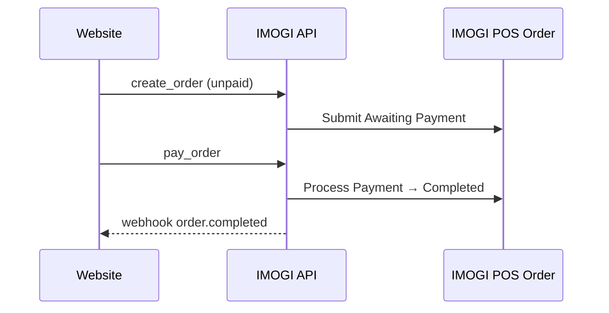

# Integrasi Website — IMOGI Order API

API untuk menerima order dari website / aplikasi eksternal ke **IMOGI POS Order**.

## Aktivasi

1. **IMOGI POS Settings** → section **Order API**
2. Centang **Enable Order API** → Save
3. Catat **API Key** dan **API Secret** (secret hanya ditampilkan sekali)

## Autentikasi

Header wajib di setiap request:

```
X-Imogi-Api-Key: <api_key>
X-Imogi-Api-Secret: <api_secret>
```

Production: **wajib HTTPS**.

## Endpoint utama

| Aksi | Method | Path |
|------|--------|------|
| Buat order | POST | `/api/method/imogi_pos.api.order.create_order` |
| Bayar order | POST | `/api/method/imogi_pos.api.order.pay_order` |
| Status order | GET | `/api/method/imogi_pos.api.order.get_order_status` |
| Void | POST | `/api/method/imogi_pos.api.order.void_order` |
| Refund penuh | POST | `/api/method/imogi_pos.api.order.refund_order` |
| Refund sebagian | POST | `/api/method/imogi_pos.api.order.partial_refund_order` |
| Katalog item | GET | `/api/method/imogi_pos.api.catalog.get_items` |
| Detail item | GET | `/api/method/imogi_pos.api.catalog.get_item` |

Dokumentasi lengkap: tombol **Dokumentasi API** di IMOGI POS Settings.

## Contoh: order + auto pay

```bash
export IMOGI_API_URL="https://your-domain.com"
export IMOGI_API_KEY="..."
export IMOGI_API_SECRET="..."

python apps/imogi_pos/scripts/test_order_api.py create \
  --item "IMOGI-001" --qty 2 --rate 3500 --auto-pay --mop Cash
```

## Contoh: order unpaid → bayar terpisah

```bash
python apps/imogi_pos/scripts/test_order_api.py flow
```

## Contoh cURL (create order)

```bash
curl -X POST "$IMOGI_API_URL/api/method/imogi_pos.api.order.create_order" \
  -H "X-Imogi-Api-Key: $IMOGI_API_KEY" \
  -H "X-Imogi-Api-Secret: $IMOGI_API_SECRET" \
  -d 'items=[{"item_code":"IMOGI-001","qty":1,"rate":3500}]' \
  -d 'order_channel=Web' \
  -d 'order_type=Takeaway'
```

## Webhook (opsional)

Settings → **Order API Webhook URL**

Event contoh: `order.created`, `order.completed`, `order.cancelled`, `order.refunded`

## Alur rekomendasi website



## File tes

- `scripts/test_order_api.env.example` — template credential
- `scripts/test_order_api.py` — tes Python
- `scripts/test_order_api.sh` — tes bash
- `scripts/test_phase1_api.py` — tes katalog + customer via bench console
